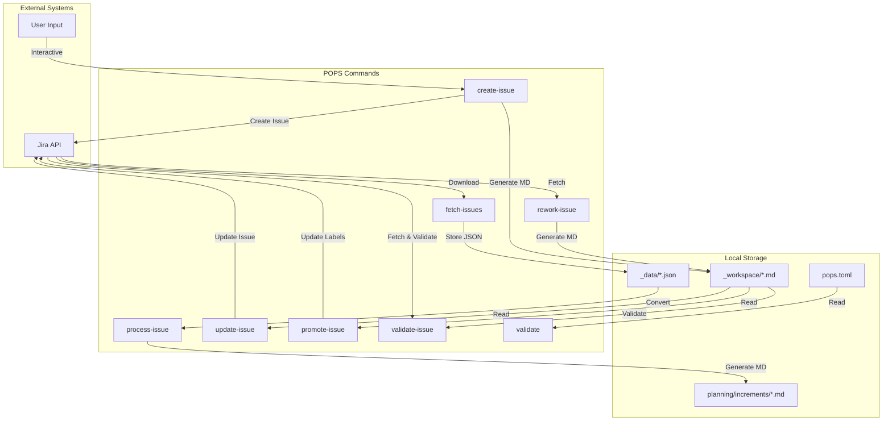
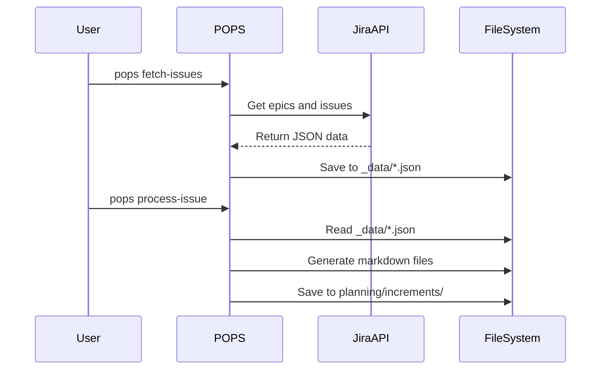
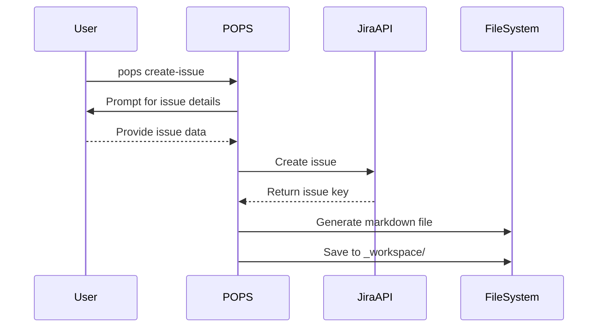
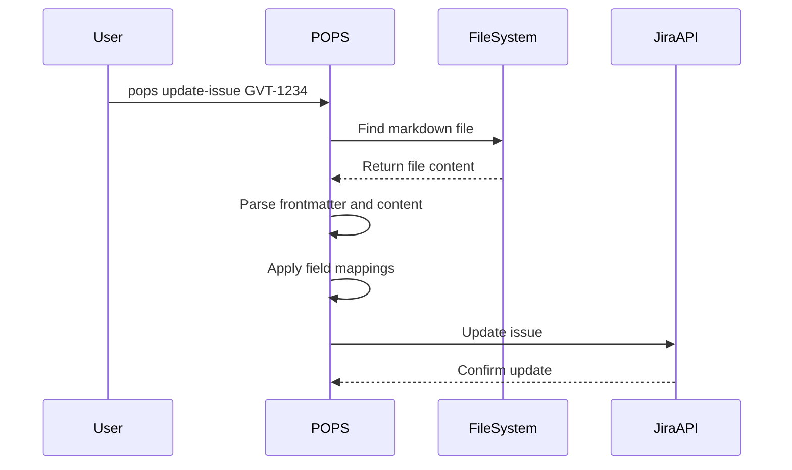
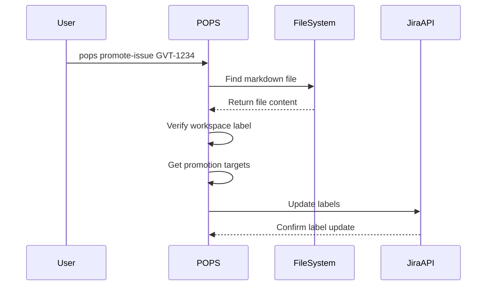
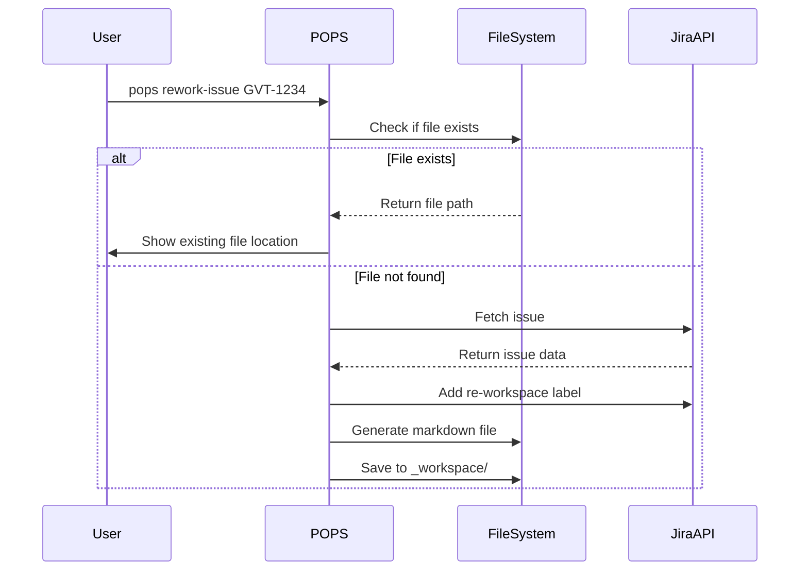
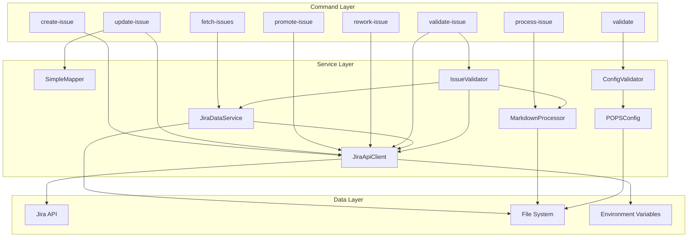
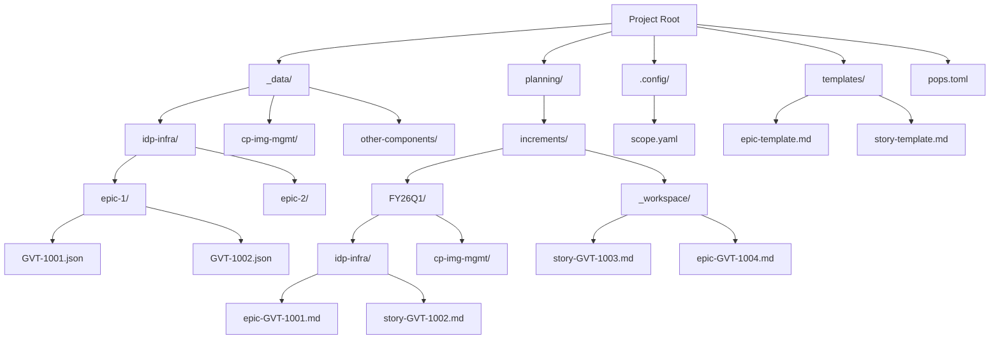
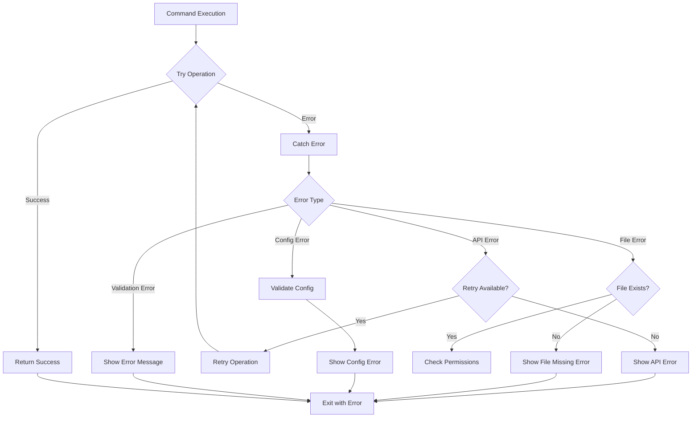

# POPS Command Data Flow Diagrams

This document contains visual representations of the data flow patterns used by POPS commands.

## Data Flow Overview

## Command-Specific Data Flows

### 1. Data Import Workflow

### 2. Issue Creation Workflow

### 3. Issue Update Workflow

### 4. Issue Promotion Workflow

### 5. Issue Rework Workflow

## Service Architecture

## Data Storage Hierarchy

## Error Handling Flow

This comprehensive documentation provides both textual and visual representations of how POPS commands interact with data sources, making it easier to understand the system architecture and troubleshoot issues.
